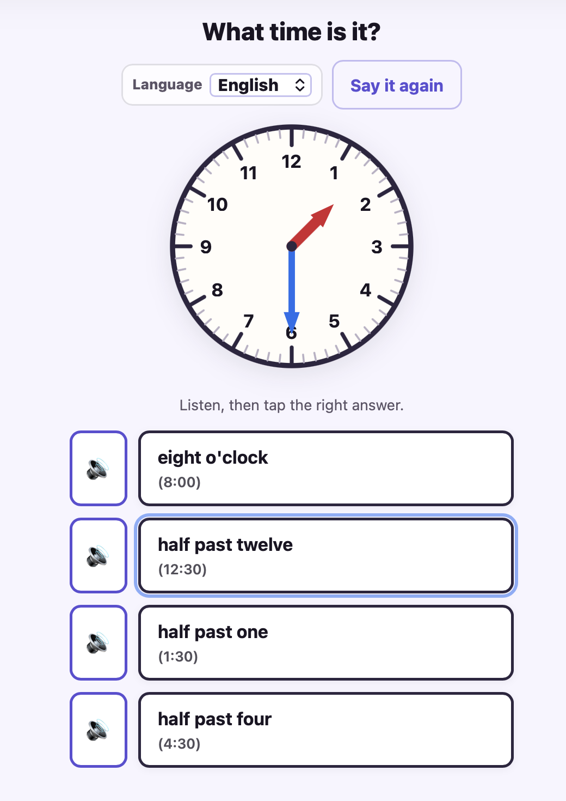
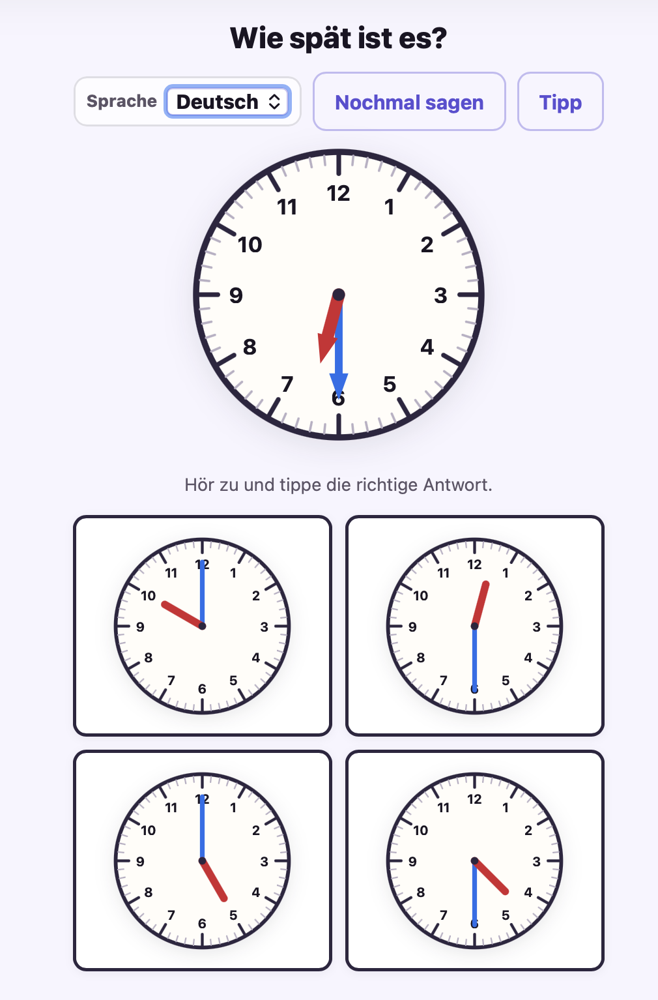

# TimeTeacher

A small web quiz to practice reading an **analog clock** at **whole hours** and **half hours**. Spoken prompts use the browser’s **text-to-speech** so young children can play without reading full sentences (numbers still appear as a bridge).

It supports **two quiz types** (mixed randomly):

- **Normal**: see a clock → pick the correct time.
- **Reverse**: hear a time → pick the correct clock face (with an optional **Hint** button to show the digital time).

## Screenshots

## How to run

Open the folder in a browser:

- **From disk:** double-click `index.html`, or drag it into Chrome / Safari / Firefox.
- **Local server (recommended):** `python3 -m http.server 8080` in this directory, then open `http://localhost:8080`.

## Install on Android (as an app icon)

This project includes a minimal PWA setup (manifest + icons) so it can be installed from **Chrome on Android** and launched like a normal app.

### 1) Publish it on GitHub Pages

1. In your GitHub repo, go to **Settings → Pages**.
2. Under **Build and deployment**:
   - **Source**: Deploy from a branch
   - **Branch**: `main` (or your default branch)
   - **Folder**: `/ (root)`
3. Save. After GitHub publishes, your site URL will look like:
   - `https://<username>.github.io/TimeTeacher/`

### 2) Install on the phone

1. On the Android phone, open the GitHub Pages URL in **Chrome**.
2. Open Chrome menu (⋮) → **Install app** (or **Add to Home screen**).
3. Tap the new icon on the home screen to launch.

Note: audio prompts require a user gesture (tap), so the app starts with a **Start** button to enable speech.

## Using it with a child

1. Tap **Start** once (needed so audio can play, especially on **iPad/iPhone Safari**).
2. A clock appears at a random hour or half hour.
3. The app asks aloud what to do.
4. **Normal rounds**: tap the matching **time**.
5. **Reverse rounds**: tap the matching **clock face** (use **Hint** if needed).
6. **Say it again** repeats the question.

Wrong answers keep the same clock and re-enable the choices so the child can try another option.

## Voices

Speech uses your system / browser voices. English is preferred when available. If the voice sounds wrong on macOS or Windows, change the default voice in system accessibility or speech settings.

## Files

- `index.html` — layout, clock SVG shell, start overlay  
- `styles.css` — layout and touch-friendly buttons  
- `app.js` — clock geometry, quiz, `speechSynthesis`  

No build step or dependencies.
